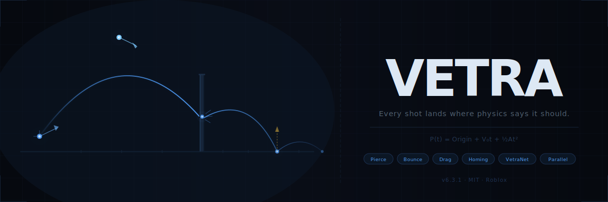

---
sidebar_position: 2
sidebar_label: "Documentation"
---



# Every Shot Lands Where Physics Says It Should

Vetra is a projectile simulation module for Roblox. It uses exact kinematic trajectories, no
per-frame drift, no frame-rate dependency, no client/server divergence, and builds a full physics
and networking stack on top of that foundation: pierce, bounce, hitscan, homing, drag (linear, quadratic,
G-series empirical models), Magnus effect, Coriolis deflection, gyroscopic drift, 6DOF aerodynamics,
tumble, fragmentation, high-fidelity sub-segment raycasting, LOD, parallel physics via Roblox
Actors, and VetraNet, a full authoritative network layer.

---

## One Folder. One Require.

Drop the `Vetra` folder into `ReplicatedStorage` and require it from your weapon scripts.

---

## The Solver Listens. You React.

```lua
local Vetra         = require(ReplicatedStorage.Vetra)
local BulletContext = Vetra.BulletContext

-- Create the solver once (connects the frame loop)
local Solver  = Vetra.new()
local Signals = Solver:GetSignals()

-- Connect to signals once at initialisation
Signals.OnHit:Connect(function(context, result, velocity)
    if result then
        print("Hit", result.Instance.Name, "at", result.Position)
    else
        -- result is nil on distance/speed expiry
        print("Bullet expired")
    end
end)

Signals.OnBounce:Connect(function(context, result, velocity, bounceCount)
    print("Bounce #" .. bounceCount)
end)
```

---

## Define the Physics. Pull the Trigger.

```lua
-- Build a behavior once per weapon type, not per shot
local Behavior = Vetra.BehaviorBuilder.new()
    :Physics()
        :MaxDistance(500)
        :MinSpeed(5)
    :Done()
    :Bounce()
        :Max(3)
        :Restitution(0.7)
        :Filter(function(context, result, vel)
            return true -- bounce off everything
        end)
    :Done()
    :Build()

-- Fire
local context = BulletContext.new({
    Origin    = muzzlePosition,
    Direction = direction,
    Speed     = 200,
})

Solver:Fire(context, Behavior)
```

---

## Don't Start From Scratch

`BehaviorBuilder` ships with three preset constructors as a starting point:

```lua
-- Sniper: 1500 studs, pierce-capable, high fidelity
local SniperBehavior = Vetra.BehaviorBuilder.Sniper():Build()

-- Grenade: low speed, bouncy, corner-trap aware
local GrenadeBehavior = Vetra.BehaviorBuilder.Grenade():Build()

-- Pistol: 300 studs, single pierce
local PistolBehavior = Vetra.BehaviorBuilder.Pistol():Build()
```

Chain additional overrides on any preset before calling `:Build()`:

```lua
local Behavior = Vetra.BehaviorBuilder.Sniper()
    :Physics()
        :MaxDistance(2000)
    :Done()
    :Build()
```

---

## Carry State With Every Bullet

Use `UserData` to attach weapon-specific data that travels with the bullet and is available in every
signal handler:

```lua
context.UserData.Damage    = 75
context.UserData.ShooterId = Players.LocalPlayer.UserId

Signals.OnHit:Connect(function(context, result, velocity)
    print("Damage:",   context.UserData.Damage)
    print("Fired by:", context.UserData.ShooterId)
end)
```

---

## Your Raycast. Your Rules.

By default Vetra uses `workspace:Raycast` for every intersection test. `CastFunction` replaces that
with any function that matches the same signature, `workspace:Spherecast`, `workspace:Blockcast`,
or a completely custom wrapper:

```lua
-- Spherecast, treats the bullet as a sphere with a radius
Solver:Fire(context, {
    MaxDistance  = 500,
    CastFunction = function(origin, direction, params)
        return workspace:Spherecast(origin, 0.5, direction, params)
    end,
})

-- Blockcast, useful for shotgun pellets or wide projectiles
Solver:Fire(context, {
    CastFunction = function(origin, direction, params)
        local size = Vector3.new(0.2, 0.2, direction.Magnitude)
        local cframe = CFrame.lookAt(origin, origin + direction)
        return workspace:Blockcast(cframe, size, direction, params)
    end,
})

-- Custom wrapper, ignore water terrain, apply a tag filter
Solver:Fire(context, {
    CastFunction = function(origin, direction, params)
        local result = workspace:Raycast(origin, direction, params)
        if result and result.Instance:HasTag("Ignored") then
            return nil
        end
        return result
    end,
})
```

`direction` is the raw displacement vector for that frame, not a unit vector. Its magnitude is the
cast distance. Do not normalise it before passing to the underlying cast call or you will cast the
wrong distance.

:::caution Serial solver only
`CastFunction` is **ignored** by `Vetra.newParallel()`, functions cannot cross Actor boundaries.
Use `Vetra.new()` if you need a custom cast function.
:::

---

## 20,000 Bullets. 10ms.

For high bullet-count scenarios, use the parallel solver to distribute physics computation across
Roblox Actors:

```lua
local Solver = Vetra.newParallel({
    ShardCount = 6,
})

-- API is identical to Vetra.new()
Solver:Fire(context, Behavior)
```

:::tip
Parallel overhead breaks even around 50–100 active bullets. Below that threshold `Vetra.new()` is
typically faster. Above ~200 bullets with physics features enabled, the parallel version scales
significantly better. If Actor construction fails internally, `newParallel` automatically falls back
to a serial solver and logs an error, your call site receives a working solver either way.
:::

:::caution
`CastFunction` overrides in `VetraBehavior` are **ignored** by the parallel solver, functions
cannot cross Actor boundaries. Use `Vetra.new()` if you need a custom cast function.
:::

---

## Stop Trusting the Client

Wrap a solver with `WithValidator` to enable authoritative hit checks on the server:

```lua
-- Server only; safe no-op on the client so setup code can be shared
local Solver = Vetra.WithValidator(Vetra.new(), {
    MaxOriginTolerance = 20,
    PositionTolerance  = 15,
    VelocityTolerance  = 80,
    TimeTolerance      = 0.15,
})
```

---

## Bullets Don't Travel in a Vacuum

Set `DragCoefficient > 0` to enable drag. Fields not exposed by `BehaviorBuilder` setters are passed
directly on the behavior table:

```lua
Solver:Fire(context, {
    MaxDistance         = 800,
    MinSpeed            = 5,
    DragCoefficient     = 0.003,
    DragModel           = "G7",   -- long boat-tail, modern sniper standard
    DragSegmentInterval = 0.05,   -- seconds between recalculation steps
})
```

**Available drag models:**

| Model | Description |
|-------|-------------|
| `"Linear"` | Deceleration ∝ speed |
| `"Quadratic"` | Deceleration ∝ speed², default, most accurate subsonic |
| `"Exponential"` | Deceleration ∝ eˢᵖᵉᵉᵈ, exotic high-drag shapes |
| `"G1"` | Flat-base spitzer; general purpose standard |
| `"G5"` | Boat-tail spitzer; mid-range rifles |
| `"G6"` | Semi-spitzer flat-base; shotgun slugs |
| `"G7"` | Long boat-tail; modern long-range / sniper standard |
| `"G8"` | Flat-base semi-spitzer; hollow points / pistols |
| `"GL"` | Lead round ball; cannons / muskets / buckshot |
| `"G2"`, `"G3"`, `"G4"` | Aberdeen / atypical projectile shapes |
| `"Custom"` | Requires `CustomMachTable = { {mach, cd}, ... }` on the behavior |

---

## Supersonic and Subsonic Profiles

Override drag, restitution, and normal perturbation per speed regime. The solver tracks whether the
bullet is supersonic (above 343 studs/s) and blends in the matching profile:

```lua
Solver:Fire(context, {
    DragCoefficient   = 0.002,
    DragModel         = "G7",
    SupersonicProfile = {
        DragCoefficient = 0.0015,
    },
    SubsonicProfile = {
        DragCoefficient    = 0.004,
        Restitution        = 0.5,
        NormalPerturbation = 0.05,
    },
    SpeedThresholds = { 343 }, -- fire OnSpeedThresholdCrossed when crossing this
})

Signals.OnSpeedThresholdCrossed:Connect(function(context, threshold, velocity)
    if threshold == 343 then print("Went subsonic") end
end)
```

---

## Spin Makes It Curve

A spinning projectile experiences lateral force perpendicular to both its spin axis and velocity —
the curveball effect. Evaluated together with drag every `DragSegmentInterval` seconds:

```lua
Solver:Fire(context, {
    SpinVector        = Vector3.new(0, 0, 1) * 300, -- right-hand twist, 300 rad/s
    MagnusCoefficient = 0.0001,
    SpinDecayRate     = 0.05,  -- 5% spin loss per second
})
```

:::caution
`MagnusCoefficient` is highly sensitive. Start at `0.00005`–`0.0001` and increase
incrementally, at high speeds even `0.001` produces dramatic deviation.
:::

---

## Gyroscopic Drift

Simulate yaw from spin-induced gyroscopic precession. Applied as a lateral acceleration each drag
recalculation step:

```lua
Solver:Fire(context, {
    GyroDriftRate = 0.5,                      -- acceleration in studs/s²
    GyroDriftAxis = Vector3.new(0, 1, 0),     -- nil = world UP (right-hand rifling)
})
```

---

## When Stability Breaks

A bullet enters tumble mode when its speed drops below a threshold, multiplying drag and adding
chaotic lateral forces. It can optionally recover:

```lua
Solver:Fire(context, {
    TumbleSpeedThreshold  = 100,   -- begin tumbling below 100 studs/s
    TumbleDragMultiplier  = 4.0,   -- drag x 4 while tumbling
    TumbleLateralStrength = 5,     -- chaotic lateral accel in studs/s²
    TumbleOnPierce        = true,  -- begin tumbling immediately on first pierce
    TumbleRecoverySpeed   = nil,   -- nil = permanent; set a number to auto-recover
})

Signals.OnTumbleBegin:Connect(function(context, velocity)
    print("Tumbling at", velocity.Magnitude, "studs/s")
end)
Signals.OnTumbleEnd:Connect(function(context, velocity)
    print("Recovered at", velocity.Magnitude, "studs/s")
end)
```

---

## One Round. Five Threats.

Spawn child bullets in a cone on pierce. Each fragment is a fully live cast inheriting the parent's
behavior:

```lua
Solver:Fire(context, {
    CanPierceFunction = function(ctx, result, vel) return true end,
    MaxPierceCount    = 1,
    FragmentOnPierce  = true,
    FragmentCount     = 5,    -- number of fragments
    FragmentDeviation = 20,   -- cone half-angle in degrees
})

Signals.OnBranchSpawned:Connect(function(parentContext, childContext)
    childContext.UserData.IsFragment = true
    childContext.UserData.Damage = parentContext.UserData.Damage * 0.3
end)
```

---

## It Will Find Them

Steer the bullet toward a dynamic target position each frame. The steering fields are set directly on
the behavior table, they are not available through the `BehaviorBuilder` `:Homing()` sub-builder
(which only exposes the `CanHomeFunction` gate filter):

```lua
local target = workspace.TargetPart

Solver:Fire(context, {
    HomingPositionProvider  = function(pos, vel)
        return target.Position  -- return nil to disengage mid-flight
    end,
    HomingStrength          = 90,  -- steering force in degrees/second
    HomingMaxDuration       = 5,   -- disengage automatically after 5 seconds
    HomingAcquisitionRadius = 0,   -- 0 = engage immediately; set a stud distance to delay
    CanHomeFunction = function(ctx, pos, vel)
        return not ctx.UserData.HomingDisabled
    end,
})

Signals.OnHomingDisengaged:Connect(function(context, reason)
    print("Homing ended:", reason)
end)
```

---

## Physics? Optional.

Replace Vetra's kinematic physics entirely with a custom position function. Useful for scripted
paths, spline-driven projectiles, or cinematic abilities:

```lua
Solver:Fire(context, {
    TrajectoryPositionProvider = function(elapsed)
        -- elapsed = seconds since this cast was fired
        -- Return nil to end the custom path and terminate the cast
        return CFrame.new(origin) * CFrame.Angles(0, elapsed, 0) * CFrame.new(0, 0, -elapsed * speed)
    end,
})
```

---

## Zero Physics. Instant Resolution.

Hitscan resolves the entire bullet path, pierce, bounce, all signals, synchronously inside `Fire()`.
No per-frame physics stepping, no gravity, no drag, no Magnus: the bullet travels in straight lines
between bounces and terminates before `Fire()` returns.

Use it for weapons where physics don't add anything: railguns, laser shots, instant-hit scanners, or
any design where the bullet arriving instantly is the point.

```lua
local Behavior = Vetra.BehaviorBuilder.new()
    :Hitscan(true)
    :Physics()
        :MaxDistance(1000)
    :Done()
    :Build()

Solver:Fire(context, Behavior)
-- By the time Fire() returns, OnHit has already fired.
```

Pierce and bounce still apply, the full hit chain runs, just synchronously. All signals (`OnHit`,
`OnBounce`, `OnPierce`, `OnTerminated`) fire in the normal order before `Fire()` returns.

:::caution No physics forces
`DragCoefficient`, `SpinVector`, `MagnusCoefficient`, gravity, homing, none of these apply to
hitscan casts. If you need a fast projectile with physics, increase speed and reduce `MaxDistance`
instead of enabling hitscan.
:::

---

## Wind

```lua
Solver:SetWind(Vector3.new(10, 0, 0))  -- 10 studs/s eastward

-- Per-bullet sensitivity via behavior table:
Solver:Fire(context, { WindResponse = 0.5 }) -- 50% of wind applied
Solver:Fire(context, { WindResponse = 0.0 }) -- ignores wind entirely
```

---

## Even the Earth Gets a Vote

Coriolis is a **solver-level environment setting**, not a per-bullet behavior field. Call
`SetCoriolisConfig` once per map/zone, all bullets fired through that solver are affected equally:

```lua
-- Arctic map, strong northern deflection
Solver:SetCoriolisConfig(75, 1200)

-- Equatorial map, horizontal east/west drift only
Solver:SetCoriolisConfig(0, 800)

-- Disable entirely (default)
Solver:SetCoriolisConfig(45, 0)
```

| Scale | Effect |
|-------|--------|
| `0` | Disabled, zero overhead (default) |
| `500` | Subtle; detectable only at long range |
| `1000` | Clearly perceptible at ~300 studs |
| `3000` | Strong, map-defining mechanic |

---

## LOD

Tell the solver where to focus simulation fidelity:

```lua
-- Update every frame with camera position (clients)
Solver:SetLODOrigin(workspace.CurrentCamera.CFrame.Position)

-- Update each frame with entity positions (server)
Solver:SetInterestPoints({ player1.Character.HumanoidRootPart.Position, ... })
```

---

## Intercept. Override. Continue.

`OnPreBounce`, `OnMidBounce`, `OnPrePenetration`, and `OnMidPenetration` receive a `MutateData`
callback as their last argument, allowing synchronous override of physics values mid-calculation:

```lua
-- Force flat-floor reflection by overriding the surface normal
Signals.OnPreBounce:Connect(function(context, result, velocity, mutate)
    mutate(Vector3.new(0, 1, 0), nil)  -- (newNormal, newIncomingVelocity)
end)

-- Force 90% restitution after the reflect math runs
Signals.OnMidBounce:Connect(function(context, result, inVel, mutate)
    mutate(nil, 0.9, nil)  -- (newPostVelocity, newRestitution, newNormalPerturbation)
end)

-- Cap pierce count for this bullet on the fly
Signals.OnPrePenetration:Connect(function(context, result, velocity, mutate)
    mutate(nil, 1)  -- (newEntryVelocity, maxPierceOverride)
end)

-- Remove speed loss on exit
Signals.OnMidPenetration:Connect(function(context, result, velocity, mutate)
    mutate(1.0, nil)  -- (newSpeedRetention, newExitVelocity)
end)
```

`MutateData` is only active during the synchronous handler. Calling it after the handler returns
logs a warning and has no effect, do not yield inside hook signal handlers.

---

## The Bullet That Refused to Die

`OnPreTermination` lets you cancel a bullet's death. Each termination reason is tracked separately —
after **3 consecutive cancels for the same reason**, the bullet is force-terminated regardless:

```lua
Signals.OnPreTermination:Connect(function(context, reason, mutate)
    if reason == "hit" and context.UserData.HasShield then
        mutate(true, nil)  -- (cancelled: boolean, newReason: string?)
    end
end)
```

---

## The Network Layer You Didn't Have to Write

VetraNet is Vetra's built-in network middleware. It handles fire-request serialization, server-side
authority, and client-side cosmetic replication, all over a single `RemoteEvent`.

**Shared setup (ModuleScript required by both sides):**
```lua
local Registry = Vetra.VetraNet.BehaviorRegistry.new()
Registry:Register("Rifle",   RifleBehavior)
Registry:Register("Shotgun", ShotgunBehavior)
return Registry
```

:::danger Registration order
Both server and client **must** register behaviors in the **same order** with the **same names**. If
they diverge, every fire request will be rejected as `RejectedUnknownBehavior`. Enforce this by
requiring the same shared ModuleScript on both sides.
:::

**Server:**
```lua
local Net = Vetra.VetraNet.new(ServerSolver, SharedRegistry, {
    MaxOriginTolerance  = 20,
    TokensPerSecond     = 10,
    BurstLimit          = 20,
    ReplicateState      = true,
})

Net.OnValidatedHit:Connect(function(owner, context, result, velocity, impactForce)
    -- apply damage, update leaderboard, etc.
end)

Net.OnFireRejected:Connect(function(player, reason)
    warn(player.Name .. " fire rejected: " .. reason)
end)
```

**Client:**
```lua
local Net = Vetra.VetraNet.new(ClientSolver, SharedRegistry)

Net:Fire(muzzlePosition, direction, speed, "Rifle")
```

---

## See Exactly What the Bullet Saw

```lua
local Behavior = Vetra.BehaviorBuilder.new()
    :Debug()
        :Visualize(true)
    :Done()
    :Build()
```

Draws cast segments, hit normals, bounce vectors, and corner-trap markers in-world. Zero runtime
cost when disabled, no draw calls or raycasts are added.