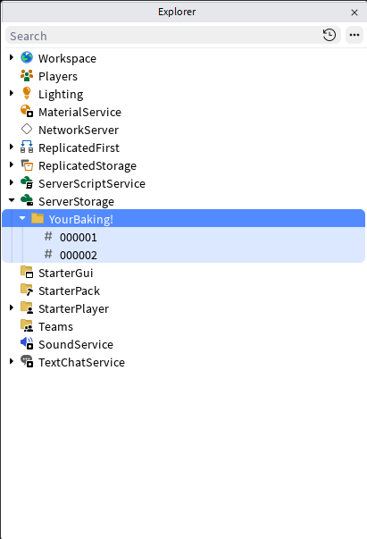

# Static Occupancy

The single most expensive thing a bullet does each frame is the **raycast**, it crosses the engine
boundary into the physics engine's broadphase and narrowphase, and its cost scales with scene
complexity. One bullet is nothing; hundreds of bullets each raycasting every frame is the dominant
cost in a busy scene.

An occupancy grid attacks that cost directly. It's a **voxelised map of where solid geometry is**.
Before each raycast, the solver asks the grid a pure-math question, *"is the segment the bullet is
about to travel definitely empty?"*, and if the answer is yes, it **skips the raycast entirely**.
No engine crossing, no broadphase, nothing.

**Static** occupancy is for geometry that doesn't move: the map, walls, terrain, buildings. You bake
it once and it answers queries for the lifetime of the round.

---

## The Idea

You bake the world's solid parts into a voxel grid at some resolution. Each voxel is either occupied
(solid geometry passes through it) or empty. To test a bullet's frame segment, the grid walks the
voxels along that segment:

- If **every** voxel on the segment is empty, the segment is provably clear -> **raycast skipped**.
- If **any** voxel is occupied, the segment *might* hit something -> the real raycast runs to find the
  exact contact.

:::danger The grid is a filter, not a hint
Once a behavior has a grid attached, **the grid decides whether a raycast happens at all**. When it
reports a segment clear, the raycast is skipped outright, no raycast means no hit, no matter what is
physically there.

So an unbaked part is not "handled by the normal raycast path", it is **invisible to bullets**. They
pass straight through it. A part ends up unbaked if it is outside the baked region, tagged
`VetraOccIgnore`, or added to the map after the bake. A segment is also reported clear when it lies
entirely outside the grid's baked bounds, so anything beyond the region you baked stops colliding
too.

The rule: **bake every region and every part you need bullets to collide with.** Only leave something
out when you genuinely want bullets to ignore it, that's what `VetraOccIgnore` is for.
:::

### Occupancy vs `RaycastParams`

These two look like they do the same job, both end up deciding what a bullet hits, but they work at
different stages and don't substitute for each other:

| | `RaycastParams` | Occupancy grid |
|---|---|---|
| **Stage** | Inside the raycast | Decides *whether* the raycast runs |
| **Question** | "Of the things this ray passes through, which count?" | "Is this span empty enough to skip the ray?" |
| **Source of truth** | Live workspace, always current | The bake, a snapshot of the world |
| **Cost** | You still pay for the raycast | Skipping the raycast *is* the optimization |

The order is what matters: the grid runs **first**, and `RaycastParams` is only consulted if the grid
says the span isn't clear. A cleared span never reaches the raycast, so its filter never runs.

That gives a clean rule for which to reach for:

- **Bullets should never hit it** (the shooter, their own cosmetic bullet, the team they're on):
  that's `RaycastParams`. It's a live, per-shot decision, and it's the only one of the two that can
  vary per bullet.
- **Nothing is there, don't bother looking**: that's the grid. It's a static, shot-independent
  performance claim about empty space.

The failure mode is treating the grid as a filter list. Leaving a part out of the bake to "make
bullets ignore it" works, but bluntly and globally, it's invisible to every bullet using that grid,
and you lose the raycast that would have told you it was there. If a *specific* bullet should ignore
a *specific* part, that's `RaycastParams`, and the part still needs baking so other bullets collide
with it.

:::note They stack
A bullet with both consults the grid first, then applies `RaycastParams` to whatever raycast
survives. A part must be **in the bake** *and* **pass the params** to be hit. Excluded from either
one, and the bullet goes through it.
:::

---

## Baking a Grid

Create a grid at a chosen voxel size, then bake a region of the workspace into it:

```lua
local Vetra = require(ReplicatedStorage.Vetra)

-- 4-stud voxels: smaller = more precise + more memory, larger = coarser + cheaper
local grid = Vetra.StaticOccupancy.new(4)

-- Bake everything inside a region box into the grid
Vetra.VoxelBaker.BakeRegion(
    grid,
    CFrame.new(0, 50, 0),          -- region center
    Vector3.new(2048, 512, 2048),  -- region size (studs)
    { Verbose = true }             -- optional: print bake stats
)
```

`BakeRegion` scans every part whose bounds fall in the region and marks the voxels each part covers.
It yields periodically so a large bake won't freeze the frame.

### Faster bakes with parallel workers

For large maps, `BakeRegionParallel` distributes the bake across Actor workers and falls back to the
serial bake if workers are unavailable:

```lua
Vetra.VoxelBaker.BakeRegionParallel(
    grid,
    CFrame.new(0, 50, 0),
    Vector3.new(4096, 512, 4096),
    8,              -- worker count
    { Verbose = true }
)
```

### Excluding parts from the bake

Tag parts with `VetraOccIgnore`, the default ignore tag, and the baker skips them. You can override
the tag list via the bake `opts`.

Tagging a part means **bullets stop colliding with it**, they'll pass through as if it weren't there.
That's the point for things bullets should ignore anyway (decals, trigger volumes, non-collidable
props), but it makes the tag a footgun on anything solid. If you tag a wall, bullets go through the
wall.

:::caution Not a "skip the grid" tag
`VetraOccIgnore` doesn't send the part back to the normal raycast path, it removes the part from the
bullet's world entirely. There's no way to have a grid attached and still collide with an unbaked
part; the raycast that would find it never runs. See [the danger note above](#the-idea).
:::

### Bake API

| Function | Description |
|----------|-------------|
| `BakeRegion(grid, cframe, size, opts?)` | Bakes every part in the region box into `grid`. Yields periodically so a large bake won't freeze the frame. Returns `grid`. |
| `BakeRegionParallel(grid, cframe, size, workers?, opts?)` | Same bake spread across Actor workers (default `8`). Warns and falls back to `BakeRegion` if workers are unavailable. Returns `grid`. |

Both take the same `opts` table, every key optional:

| Key | Default | Description |
|-----|--------:|-------------|
| `Verbose` | `false` | Print part count, voxel count, elapsed time, and voxel size when the bake finishes. |
| `ignoreTags` | `{ "VetraOccIgnore" }` | Tags whose tagged instances are excluded from the bake. |
| `overlapParams` | `nil` | Your own `OverlapParams`, replaces the tag-built one entirely. `ignoreTags` is ignored if you pass this. |

:::note Shape-aware marking
The baker isn't a bounding-box approximation. Balls, cylinders, wedges, and corner wedges are marked
against their true shape, so a wedge doesn't mark the empty half of its bounding box. MeshParts,
Unions, and parts with a `SpecialMesh` can't be resolved this way and fall back to filling their full
bounding box, meaning a mesh marks more voxels than it strictly occupies. That's the safe direction
to err, an over-marked voxel costs a real raycast, while an under-marked one would skip geometry
that's actually there.
:::

---

## Attaching It to a Behavior

A baked grid does nothing until a behavior references it. Attach it with the builder:

```lua
local Behavior = Vetra.BehaviorBuilder.new()
    :Physics():MaxDistance(1000):Done()
    :StaticOccupancy(grid)
    :Build()
```

From then on, every bullet fired with that behavior consults the grid before each raycast.

| Setter | Field | Default | Description |
|--------|-------|--------:|-------------|
| `:StaticOccupancy(grid)` | `StaticOccupancy` | `nil` | The baked grid to test segments against. `nil` disables it. |

---

## When It Helps (and When It Doesn't)

The grid pays off when **most segments are empty air**, long-range fire across open maps, dense
volleys where the majority of bullets are mid-flight over nothing. In those scenes it can collapse
the overwhelming majority of raycasts into cheap voxel walks.

It helps *less*, or not at all, when bullets spend most of their travel near or inside geometry
(every segment touches an occupied voxel, so the real raycast runs anyway). And there's a memory and
bake-time cost proportional to the region size and voxel resolution.

:::note Parallel-path nuance
On the serial solver, static occupancy is a clear win in open scenes. On the parallel solver its
value is more situational, the parallel base step already spreads raycasts across cores, so skipping
them buys less. It shines most on the parallel **high-fidelity** path, where each bullet would
otherwise fire many sub-segment raycasts per frame. Profile your own scene to decide.
:::

---

## Choosing a Voxel Size

Voxel size is the core tradeoff:

| Voxel size | Precision | Memory | Bake time |
|-----------:|-----------|--------|-----------|
| Small (1,2 studs) | Resolves thin walls; fewer false "occupied" | Higher | Slower |
| Large (6,8 studs) | Coarse; thin walls may over-mark neighbours | Lower | Faster |

Match voxel size to the thinnest geometry you need the grid to resolve. If a wall is thinner than a
voxel, the grid still marks that voxel occupied, so the bullet correctly falls back to a real
raycast there; you just get fewer skips near thin geometry. A voxel size around the scale of your
typical cover thickness is a reasonable starting point.

---

## Serialization: Bake Once, Load Forever

Baking is the expensive part, and for static geometry the result never changes. Rather than
re-voxelizing the map on every server start, bake **once** in Studio, save the result into the place
file, and load it at runtime.

`grid:Serialize()` returns the grid as a binary string. `OccupancyChunks` handles getting that string
into and out of the place file: a serialized grid easily exceeds Roblox's per-`StringValue` limit, so
`Write` base64-encodes the blob and splits it across numbered `StringValue` chunks under a folder.

### Step 1: bake and save (run once, from the Studio command bar)

```lua
local ServerStorage = game:GetService("ServerStorage")
local Vetra         = require(ReplicatedStorage.Vetra)

local grid = Vetra.StaticOccupancy.new(4)
Vetra.VoxelBaker.BakeRegion(
    grid,
    CFrame.new(0, 50, 0),
    Vector3.new(2048, 512, 2048),
    { Verbose = true }
)

local folder = Instance.new("Folder")
folder.Name   = "YourBaking!"
folder.Parent = ServerStorage

Vetra.OccupancyChunks.Write(folder, grid:Serialize())
```

The generated folder has to end up in the **place file**, not just in a running session. There are
two ways to get it there:

- **Run it from the command bar while not playtesting.** The folder is created directly in the edit
  session, so saving the place keeps it. Simplest option.
- **Run it during a playtest, then copy the folder out.** Right-click the folder in the Explorer and
  **Copy** it *before* stopping, then **Paste** it back into `ServerStorage` once you're back in edit
  mode. Everything the run created is discarded when the playtest ends, so copying afterwards is too
  late.

Either way, save the place afterwards. You'll end up with a folder of numbered chunks in the
Explorer:



Each numbered child is one base64 `StringValue`, and the folder itself carries the bake's metadata as
attributes, which the Explorer doesn't show:

```text
ServerStorage
└── YourBaking!          -- attributes: ChunkCount, Version, ByteLength
    ├── 000001           -- StringValue, base64 chunk
    └── 000002
```

The chunk count depends on grid size; a small bake may produce a single `000001`. `Write` clears any
existing `StringValue` children first, so re-baking into the same folder replaces the old data rather
than corrupting it by mixing chunk sets.

### Step 2: load at runtime

```lua
local blob = Vetra.OccupancyChunks.Read(ServerStorage:FindFirstChild("YourBaking!"))
local grid = Vetra.StaticOccupancy.Deserialize(blob)

local Behavior = Vetra.BehaviorBuilder.new()
    :StaticOccupancy(grid)
    :Build()
```

`Read` sorts the chunks by name and concatenates them, so the numeric `%06d` names matter, don't
rename them. It returns `nil` if the folder is missing or holds no `StringValue` children, which lets
you fall back to a live bake:

```lua
local folder = ServerStorage:FindFirstChild("YourBaking!")
local blob   = Vetra.OccupancyChunks.Read(folder)

local grid
if blob then
    grid = Vetra.StaticOccupancy.Deserialize(blob)
else
    warn("No baked occupancy found — baking at startup")
    grid = Vetra.StaticOccupancy.new(4)
    Vetra.VoxelBaker.BakeRegion(grid, CFrame.new(0, 50, 0), Vector3.new(2048, 512, 2048))
end
```

`Deserialize` reads the voxel size out of the blob's header, so the loaded grid always matches the
size it was baked at, you don't pass it again. It asserts on a bad header (`bad magic (not a Vetra
occupancy bake)`), so a wrong or corrupted folder fails loudly rather than silently producing an
empty grid.

:::caution Re-bake when the map changes
A loaded grid describes the geometry as it was **at bake time**, and the grid is what bullets
collide against. Move a wall and bullets keep colliding with where it used to be and pass straight
through where it now is. A part added after the bake doesn't exist as far as bullets are concerned.

Re-bake and re-save whenever static geometry changes. The `Version` attribute is there for you to
stamp your own map revision so you can detect a stale bake instead of shipping one.
:::

| Function | Returns | Description |
|----------|---------|-------------|
| `grid:Serialize()` | `string` | The grid as a binary blob. |
| `Vetra.StaticOccupancy.Deserialize(blob)` | `grid` | Rebuilds a grid from a blob. Voxel size comes from the header. |
| `Vetra.OccupancyChunks.Write(folder, blob, version?)` | `,` | Base64-encodes and splits `blob` across `StringValue` chunks under `folder`. Clears existing chunks first, and sets the `ChunkCount`, `Version`, and `ByteLength` attributes. |
| `Vetra.OccupancyChunks.Read(folder?)` | `string?` | Reassembles and decodes the blob. `nil` if `folder` is `nil` or has no chunks. |
