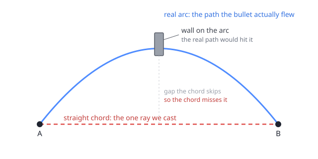

# The Tunnelling Problem

A curving bullet passes through a wall its trajectory clearly crosses, but only sometimes, and more
on slower hardware. This isn't your code, it's the math underneath most weapon systems.

Each frame, a bullet is advanced from where it was (**A**) to where it is now (**B**), and a single
ray is cast **straight** from A to B to check what it hit. On a straight-line shot that's exact, the
ray *is* the path. But the moment the trajectory curves, from gravity, drag, Magnus, homing, or a
`TrajectoryPositionProvider`, the real path between A and B is an **arc**, and the straight A-B ray
is only its **chord**. A wall the arc flies through can sit off to the side of that chord, so the one
ray never tests it and the bullet passes through a wall it should have hit:



The bigger the hop, the more the arc departs from its chord. At 600 studs/s and 60 fps a frame moves
**10 studs**; at 30 fps it's **20**, so the same weapon tunnels more on a slower machine. Thin walls
are the usual victims, not because a straight ray can't hit a thin wall (between A and B it hits any
wall, thin or thick), but because a thin wall is small enough to fit in the offset between the arc
and its chord, where no ray is cast.

Vetra closes the gap with **high-fidelity sub-segments**: the frame's travel is broken into short
chords no longer than `HighFidelitySegmentSize` studs, each sampled from the true trajectory, so the
cast path hugs the arc instead of cutting across it. The finer the segments, the closer to the real
curve, and the smaller the surface that can slip between cast and path.

```lua
local Behavior = Vetra.BehaviorBuilder.new()
    :HighFidelity()
        :SegmentSize(0.2)  -- each sub-ray spans at most 0.2 studs of the arc
        :FrameBudget(4)    -- spend at most 4ms/frame on sub-segments
    :Done()
    :Build()
```

An adaptive controller tracks the real wall-clock cost and scales segment size to stay near your
budget, so arc coverage self-adjusts to what the frame can afford. See
[High Fidelity](./high-fidelity) for choosing these values.

---

## The Second Trap: Rays That Land Exactly on a Surface

There's a subtler version of the same problem. Vetra handles it for you, but it's worth knowing it
exists, both to trust the library and because a custom `CastFunction` can reopen it.

A Roblox raycast ignores a wall it *starts* inside of, and a ray that *ends* exactly on a wall face
doesn't count that face as hit. Both are
[known](https://devforum.roblox.com/t/raycasts-can-completely-miss-the-target-when-close-enough/2672694)
[Roblox](https://devforum.roblox.com/t/rays-dont-collide-with-parts-if-the-origin-is-inside-the-part/6283)
behaviours, not specific to Vetra.

Each frame's ray ends where the next frame's ray begins. Usually that shared point is somewhere in
open air and none of this matters. But if it lands exactly on a wall face, both rays lose it: the
first one ends on the face (doesn't count) and the second one starts on the face (already inside,
ignored). The wall sits in the seam between them and the bullet goes straight through.

It takes an exact landing to trigger, so it's an edge case and happens rarely.

### How Vetra fixes it

Each ray starts a hair *earlier* than where the bullet actually is, a fraction of a thousandth of a
stud. Consecutive rays then overlap slightly instead of meeting at a single shared point, so there's
no seam for a wall to hide in: if one ray's endpoint lands on a face, the next ray has already begun
before it and sees it normally.

Only the **start** of the ray moves back. The end stays exactly where the bullet is, so a ray can
never reach past the bullet and report a hit early. It only re-covers a sliver of ground the previous
ray already checked and found clear. Distance travelled and travel events still use the bullet's true
position, the offset applies to the raycast alone.

The offset grows with distance from the world origin, because floating-point numbers get less precise
the larger they are, so a fixed value would be too small out at the edges of a big map. It is applied
on all three stepping paths, serial and both parallel solvers, so you get it everywhere without
configuring anything.

:::info Custom `CastFunction`
Vetra passes the already-nudged `origin` and `direction` into your `CastFunction`. Cast from those
arguments directly, if you recompute your own origin from the bullet position, you discard the
protection and the seam can reopen. Passing the given arguments straight to `workspace:Raycast` is
always safe.
:::
